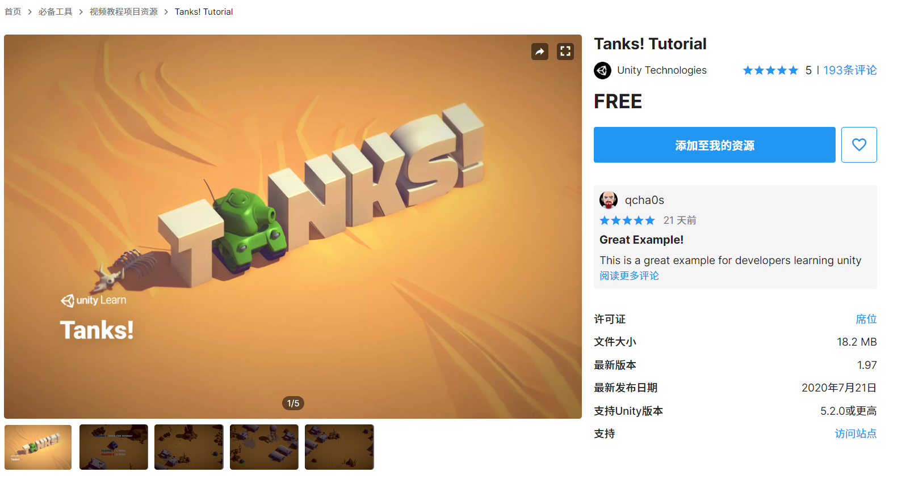
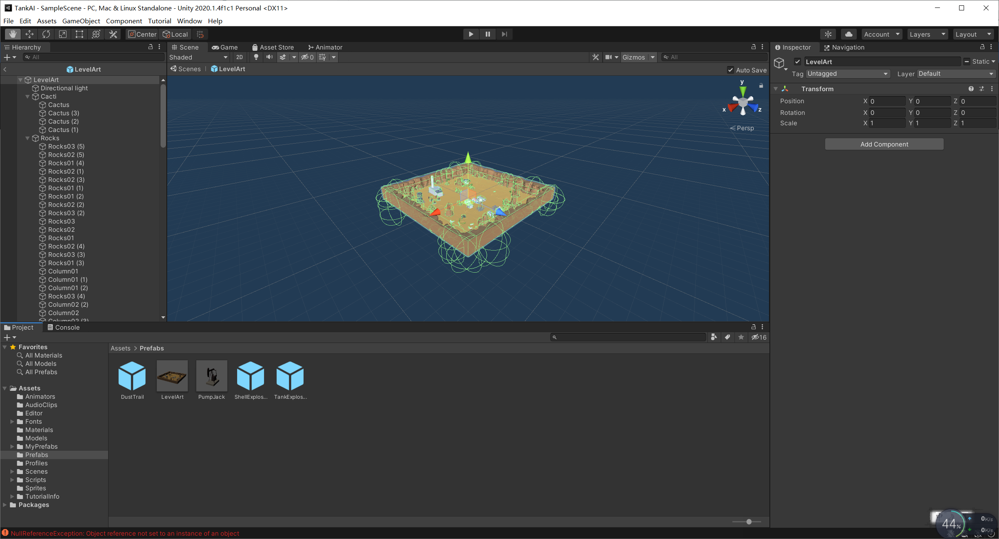
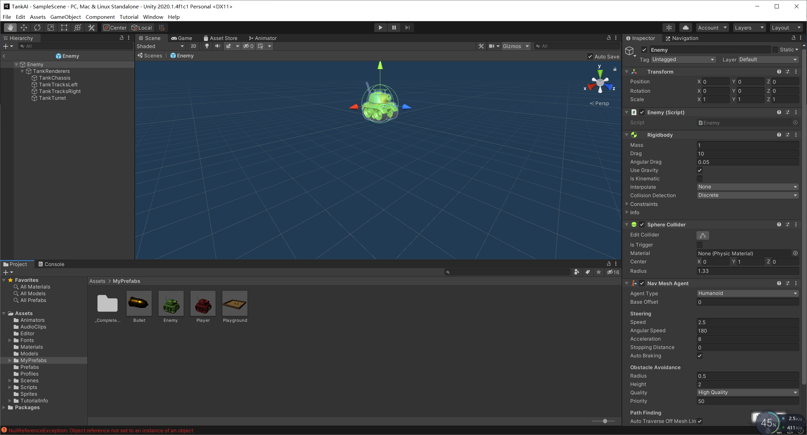
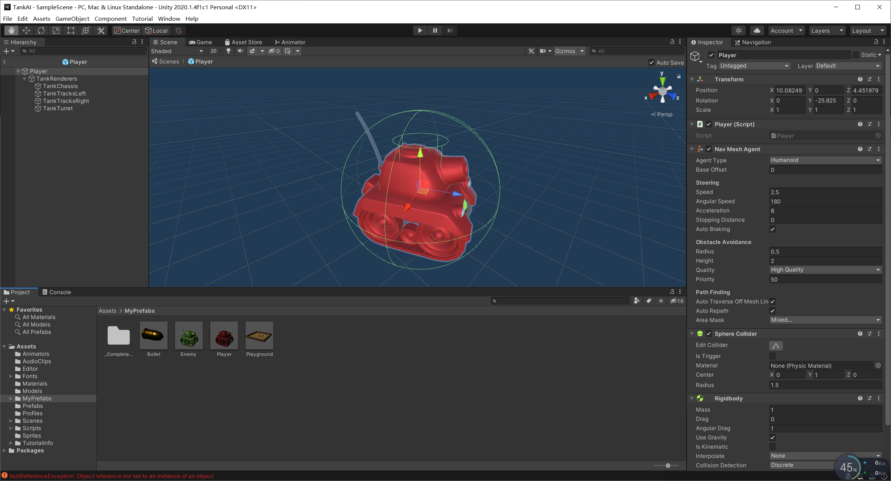
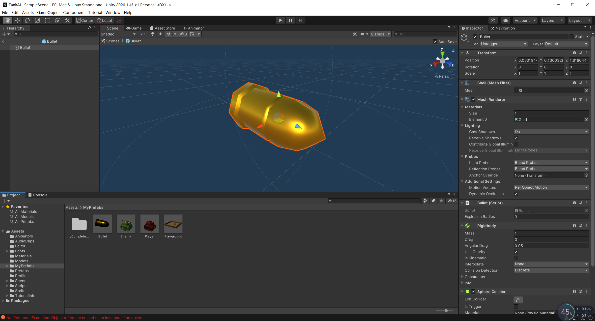
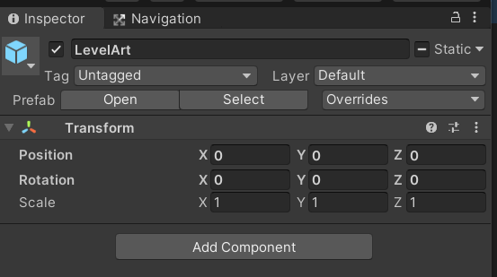
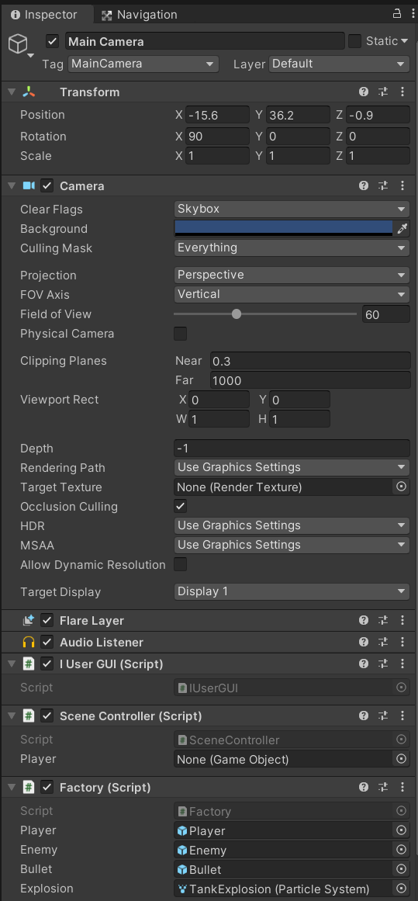

#  3D游戏编程与设计——游戏智能

### 作业要求

坦克对战游戏 AI 设计

从商店下载游戏：“Kawaii” Tank 或 其他坦克模型，构建 AI 对战坦克。具体要求

- 使用“感知-思考-行为”模型，建模 AI 坦克
- 场景中要放置一些障碍阻挡对手视线
- 坦克需要放置一个矩阵包围盒触发器，以保证 AI 坦克能使用射线探测对手方位
- AI 坦克必须在有目标条件下使用导航，并能绕过障碍。（失去目标时策略自己思考）
- 实现人机对战

### 实验过程

#### **预制制作**

​	我们先从asset store中下载 Tanks! Tutorial 资源包



然后我们利用里面的 Model 资源制作我们自己的 prefabs


一开始使用自己的playground，发现自己的障碍物设置的不是很合理，所以最后使用了资源包中自带的LevelArt



**Enemy**

敌方坦克会根据我方的位置进行射击。



**Player**

玩家可以通过w和s两个键来控制坦克的移动，Space键来控制是否开火。



**Bullet**



#### 	代码编写

为了使得代码不再那么耦合，我们显示创建了 Tank 基类。

```c#
using System.Collections;
using System.Collections.Generic;
using UnityEngine;

public class Tank : MonoBehaviour
{
    private float hp = 100.0f;
    public Tank(){
        hp = 100.0f;
    }
    public float getHP(){
        return hp;
    }
    public void setHP(float hp){
        this.hp = hp;
    }
    public void shoot(TankType type){
        GameObject bullet = Singleton<Factory>.Instance.getBullets(type);
        bullet.transform.position = new Vector3(transform.position.x, 1.5f, transform.position.z) + transform.forward * 1.5f;
        bullet.transform.forward = transform.forward; 
        bullet.GetComponent<Rigidbody>().AddForce(bullet.transform.forward * 20, ForceMode.Impulse);
    }
    // Start is called before the first frame update
    void Start()
    {
        
    }

    // Update is called once per frame
    void Update()
    {
        
    }
}

```

之后在基类的基础上创建了 Enemy 类以及 Player 类

**Enemy:**

```c#
using System.Collections;
using System.Collections.Generic;
using UnityEngine;

public class Enemy : Tank
{
    public delegate void RecycleEnemy(GameObject enemy);
    public static event RecycleEnemy recycleEnemy;
    private Vector3 playerLocation;
    private bool gameover;
    // Start is called before the first frame update
    void Start()
    {
        playerLocation = GameDirector.getInstance().currentSceneController.getPlayer().transform.position;
        StartCoroutine(shoot());
    }

    // Update is called once per frame
    void Update()
    {
        playerLocation = GameDirector.getInstance().currentSceneController.getPlayer().transform.position;
        gameover = GameDirector.getInstance().currentSceneController.getGameOver();
        if (!gameover)
       {
           if (getHP() <= 0 && recycleEnemy != null)
           {
               recycleEnemy(this.gameObject);
           }
           else
           {
               UnityEngine.AI.NavMeshAgent agent = gameObject.GetComponent<UnityEngine.AI.NavMeshAgent>();
               agent.SetDestination(playerLocation);
             
           }
       }
       else
       {
           UnityEngine.AI.NavMeshAgent agent = gameObject.GetComponent<UnityEngine.AI.NavMeshAgent>();
           agent.velocity = Vector3.zero;
           agent.ResetPath();
       }
   }
   IEnumerator shoot()
   {
       while (!gameover)
       {
           for(float i =1;i> 0; i -= Time.deltaTime)
           {
               yield return 0;
           }
           if(Vector3.Distance(playerLocation,gameObject.transform.position) < 14)
           {
               shoot(TankType.ENEMY);
           }
       }
   }
}

```

**Player:**

```c#
using System.Collections;
using System.Collections.Generic;
using UnityEngine;

public class Player : Tank
{
    public delegate void DestroyPlayer();
    public static event DestroyPlayer destroyEvent;
    // Start is called before the first frame update
    void Start()
    {
        setHP(200);
    }

    // Update is called once per frame
    void Update()
    {
        if(getHP() <= 0){
            this.gameObject.SetActive(false);
            destroyEvent();
        }
    }
    public void moveForward(){
        gameObject.GetComponent<Rigidbody>().velocity = gameObject.transform.forward * 30;
    }
    public void moveBackward(){
        gameObject.GetComponent<Rigidbody>().velocity = gameObject.transform.forward * -30;
    }
    public void turnAround(float offsetX){
        float x = gameObject.transform.localEulerAngles.x;
        float y = gameObject.transform.localEulerAngles.y + offsetX * 2;
        gameObject.transform.localEulerAngles = new Vector3(x, y, 0);
    }
}
```

然后为了能够让坦克之间进行互动，我们创建了 Bullet 类

```c#
using System.Collections;
using System.Collections.Generic;
using UnityEngine;

public class Bullet : MonoBehaviour {
    public float explosionRadius = 3.0f;
    private TankType tankType;
    public void setTankType(TankType type)
    {
        tankType = type;
    }
    private void OnCollisionEnter(Collision collision)
    {
        if(collision.transform.gameObject.tag == "tankEnemy" && this.tankType == TankType.ENEMY ||
            collision.transform.gameObject.tag == "tankPlayer" && this.tankType == TankType.PLAYER)
        {
            return;
        }
        Factory factory = Singleton<Factory>.Instance;
        ParticleSystem explosion = factory.getParticleSystem();
        explosion.transform.position = gameObject.transform.position;
        Collider[] colliders = Physics.OverlapSphere(gameObject.transform.position, explosionRadius);

        foreach(var collider in colliders)
        {
            float distance = Vector3.Distance(collider.transform.position, gameObject.transform.position);
            float hurt;
            if (collider.tag == "tankEnemy" && this.tankType == TankType.PLAYER)
            {
                hurt = 300.0f / distance;
                collider.GetComponent<Tank>().setHP(collider.GetComponent<Tank>().getHP() - hurt);
            }
            else if(collider.tag == "tankPlayer" && this.tankType == TankType.ENEMY)
            {
                hurt = 100.0f / distance;
                collider.GetComponent<Tank>().setHP(collider.GetComponent<Tank>().getHP() - hurt);
            }
            explosion.Play();
        }

        if (gameObject.activeSelf)
        {
            factory.recycleBullet(gameObject);
        }
    }

}

```

创建完所有的游戏对象后，接下来就是我们的工厂的建立以及单例的创建。

**工厂类:**

```c#
using System.Collections;
using System.Collections.Generic;
using UnityEngine;
public enum TankType {PLAYER , ENEMY};
public class Factory : MonoBehaviour
{
   public GameObject player;
   public GameObject enemy;
   public GameObject bullet;
   public ParticleSystem explosion;

   private List<GameObject> usingTanks;
   private List<GameObject> freeTanks;
   private List<GameObject> usingBullets;
   private List<GameObject> freeBullets;
   private GameObject role;
   private List<ParticleSystem> particles;
    // Start is called before the first frame update
    private void Awake()
   {
       usingTanks = new List<GameObject>();
       freeTanks = new List<GameObject>();
       usingBullets = new List<GameObject>();
       freeBullets = new List<GameObject>();
       particles = new List<ParticleSystem>();
       role = GameObject.Instantiate<GameObject>(player) as GameObject;
       role.SetActive(true);
       role.transform.position = Vector3.zero;
   }
    void Start()
    {
        Enemy.recycleEnemy += recycleEnemy;
    }

    // Update is called once per frame
    void Update()
    {
        
    }
    public GameObject getPlayer()
   {      
       return role;
   }
    public GameObject getEnemys()
   {
       GameObject newTank = null;
       if (freeTanks.Count <= 0)
       {
           newTank = GameObject.Instantiate<GameObject>(enemy) as GameObject;
           usingTanks.Add(newTank);
           newTank.transform.position = new Vector3(Random.Range(-100, 100), 0, Random.Range(-100, 100));
       }
       else
       {
           newTank = freeTanks[0];
           freeTanks.RemoveAt(0);
           usingTanks.Add(newTank);
       }
       newTank.SetActive(true);
       return newTank;
   }
    public GameObject getBullets(TankType type)
   {
       GameObject newBullet;
       if(freeBullets.Count <= 0)
       {
           newBullet = GameObject.Instantiate<GameObject>(bullet) as GameObject;
           usingBullets.Add(newBullet);
           newBullet.transform.position = new Vector3(Random.Range(-100, 100), 0, Random.Range(-100, 100));
       }
       else
       {
           newBullet = freeBullets[0];
           freeBullets.RemoveAt(0);
           usingBullets.Add(newBullet);
       }
       newBullet.GetComponent<Bullet>().setTankType(type);
       newBullet.SetActive(true);
       return newBullet;
   }
    public ParticleSystem getParticleSystem()
   {
       foreach(var particle in particles)
       {
           if (!particle.isPlaying)
           {
               return particle;
           }
       }
       ParticleSystem newPS = GameObject.Instantiate<ParticleSystem>(explosion);
       particles.Add(newPS);
       return newPS;
   }

    public void recycleEnemy(GameObject enemyTank)
   {
       usingTanks.Remove(enemyTank);
       freeTanks.Add(enemyTank);
       enemyTank.GetComponent<Rigidbody>().velocity = Vector3.zero;
       enemyTank.SetActive(false);
   }

    public void recycleBullet(GameObject Bullet)
   {
       usingBullets.Remove(Bullet);
       freeBullets.Add(Bullet);
       Bullet.GetComponent<Rigidbody>().velocity = Vector3.zero;
       Bullet.SetActive(false);
   }
}

```

单例:

```c#
using System.Collections;
using System.Collections.Generic;
using UnityEngine;

public class Singleton<T> : MonoBehaviour where T :MonoBehaviour {
   protected static T instance;
   public static T Instance
   {
       get
       {
           if(instance == null)
           {
               instance = (T)FindObjectOfType(typeof(T));
               if(instance == null)
               {
                   Debug.LogError("An instance of " + typeof(T) + " is needed in the scene , but there is none.");
               }
           }
           return instance;
       }
   }
}
```

之后就是用户操作UI

```c#
using System.Collections;
using System.Collections.Generic;
using UnityEngine;

public class IUserGUI : MonoBehaviour {
    IUserAction action;

	// Use this for initialization
	void Start () {
        action = GameDirector.getInstance().currentSceneController as IUserAction;
	}
	
	// Update is called once per frame
	void Update () {
        if (!action.getGameOver())
        {
            if (Input.GetKey(KeyCode.W))
            {
                action.moveForward();
            }

            if (Input.GetKey(KeyCode.S))
            {
                action.moveBackWard();
            }

           
            if (Input.GetKeyDown(KeyCode.Space))
            {
                action.shoot();
            }
            float offsetX = Input.GetAxis("Horizontal");
            action.turn(offsetX);
        }
    }

    void OnGUI()
    {
        if (action.getGameOver())
        {
            GUIStyle fontStyle = new GUIStyle();
            fontStyle.fontSize = 30;
            fontStyle.normal.textColor = new Color(0, 0, 0);
            GUI.Button(new Rect(Screen.width/2-50, Screen.height/2-50, 200, 50), "GameOver!");
        }
    }
}
```

附带着需要完成用户动作IUserAction

```c#
using System.Collections;
using System.Collections.Generic;
using UnityEngine;


public interface IUserAction
{
    void moveForward();
    void moveBackWard();
    void turn(float offsetX);
    void shoot();
    bool getGameOver();
}
```

之后就是场景控制器以及导演类的创建

**SceneController:**

```c#
using System.Collections;
using System.Collections.Generic;
using UnityEngine;

public class SceneController : MonoBehaviour,IUserAction{
    public GameObject player;
    private int enemyCount = 6;
    private bool gameOver = false;
    private GameObject[] enemys;
    private Factory myFactory;
    public GameDirector director;
    private void Awake()
    {
        director = GameDirector.getInstance();
        director.currentSceneController = this;
        enemys = new GameObject[enemyCount];
        gameOver = false;
        myFactory = Singleton<Factory>.Instance;
       
    }
   
    void Start () {
        player = myFactory.getPlayer();
        for (int i = 0; i < enemyCount; i++)
        {
            enemys[i]=myFactory.getEnemys();
        }
        Player.destroyEvent += setGameOver;
    }
	
	// Update is called once per frame
	void Update () {
        Camera.main.transform.position = new Vector3(player.transform.position.x, 18, player.transform.position.z);
    }

    public GameObject getPlayer()
    {
        return player;
    }

    public bool getGameOver()
    {
        return gameOver;
    }

    public void setGameOver()
    {
        gameOver = true;
    }

    public void moveForward()
    {
        player.GetComponent<Player>().moveForward();
    }
    public void moveBackWard()
    {
        player.GetComponent<Player>().moveBackward();
    }

    public void turn(float offsetX)
    {
        player.GetComponent<Player>().turnAround(offsetX);
    }

    public void shoot()
    {
        player.GetComponent<Player>().shoot(TankType.PLAYER);
    }

}

```

**GameDirector:**

```c#
using System.Collections;
using System.Collections.Generic;
using UnityEngine;

public class GameDirector : System.Object {
   private static GameDirector _instance;
   public SceneController currentSceneController { get; set; }

   private GameDirector() { }
   public static GameDirector getInstance()
   {
       if(_instance == null)
       {
           _instance = new GameDirector();
       }
       return _instance;
   }
}

```

至此所有的代码就全部写完了。

#### 展示流程

我们优先需要将 Prefabs 里面的 LevelArt 地图拖入场景中

Transform设置成如下



然后将 Scripts/MyScripts 中的 IUserGUI 、 Factory 以及 SceneController 脚本拖入Main Camera并将 Camera 的 Transform调整成如下所示。



然后将预制拖入具体位置,其中粒子效果的预制是利用原资源包中有的 TankExplosion ，位置在 Prefabs/TankExplosion 。这次作业我是借鉴[学长博客](https://blog.csdn.net/bkjs626/article/details/80731197)的内容。

#### 最终效果

