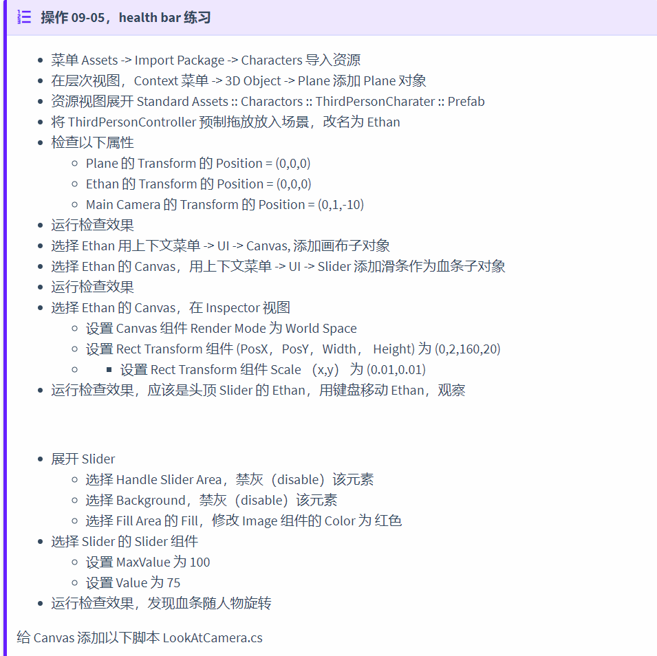
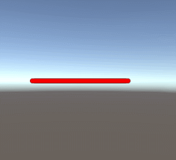
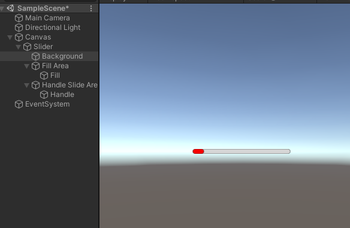
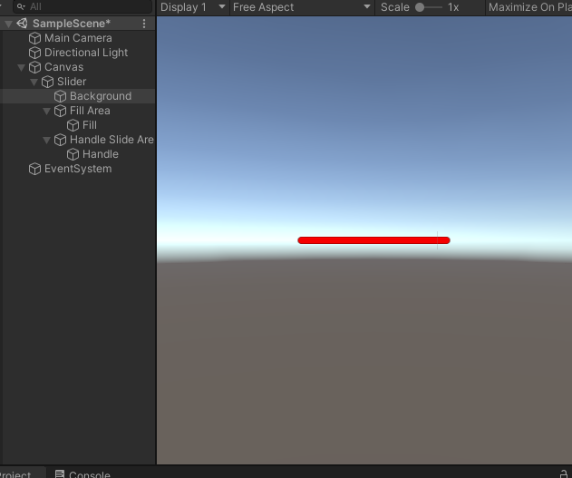
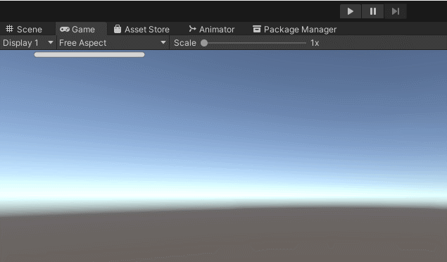

# UI系统作业与练习

###  作业与练习

- 血条（Health Bar）的预制设计。具体要求如下：
    - 分别使用 IMGUI 和 UGUI 实现
    - 使用 UGUI，血条是游戏对象的一个子元素，任何时候需要面对主摄像机
    - 分析两种实现的优缺点
    - 给出预制的使用方法

### 实现过程

**IMGUI：**

​	我们使用HorizontalScrollbar来对于血条进行模拟。我们在OnGUI方法中对于血条的位置以及按钮的作用进行了描述。

```c#
using System.Collections;
using System.Collections.Generic;
using UnityEngine;

public class BloodValue : MonoBehaviour
{
   public float bloodValue;

    private float tmpValue;

    void Start()
    {
        tmpValue = 0.0f;
        bloodValue = 0.0f;
    }

    void OnGUI()
    {    
        if (GUI.Button(new Rect(250, 20, 40, 20), "+"))
        {
            if(tmpValue < 0.9f){
                tmpValue += 0.1f;
            }
            else{
                tmpValue = 1.0f;
            }
        }

        if (GUI.Button(new Rect(250, 50, 40, 20), "-"))
        {
            if(tmpValue > 0.1f){
                tmpValue -= 0.1f;
            }
            else{
                tmpValue = 0.0f;
            }
        }

        bloodValue = Mathf.Lerp(bloodValue, tmpValue, 0.01f);

        GUI.color = Color.red;
        GUI.HorizontalScrollbar(new Rect(20, 20, 200, 20), 0.0f, bloodValue,0.0f, 1.0f, GUI.skin.GetStyle("HorizontalScrollbar"));

    }
}

```

**UGUI：**

​	这一方面我们按照课件中的描述进行设置。



```c#
using UnityEngine;

public class LookAtCamera : MonoBehaviour {

	void Update () {
		this.transform.LookAt (Camera.main.transform.position);
	}
}
```

### 实际效果

**IMGUI：**



**UGUI：**






**两者结合：**



### 两种方法各自的优缺点

**IMGUI:**

- 优点：
    - 操作简单，可以通过各种预制让刚入门的小白能够快速上手
    - 同时可以在线调试
    - 定义了Unity新的编译工具
    - 避免了UI一直在屏幕最前端
- 缺点：
    - 传统代码创建的UI效率低下

**UGUI：**

- 优点：
    - 所见即所得（WYSIWYG）设计工具，设计师也能参与程序开发
    - 支持多模式以及多摄像机渲染
    - UI元素和游戏场景融为一体
    - 面向对象的编程
- 缺点：
    - 使用起来较为繁琐，对新手不是很友好

### 预制使用方法

将IMGUI以及UGUI的预制拖入场景即可。