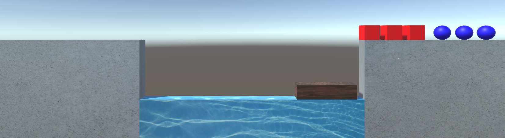
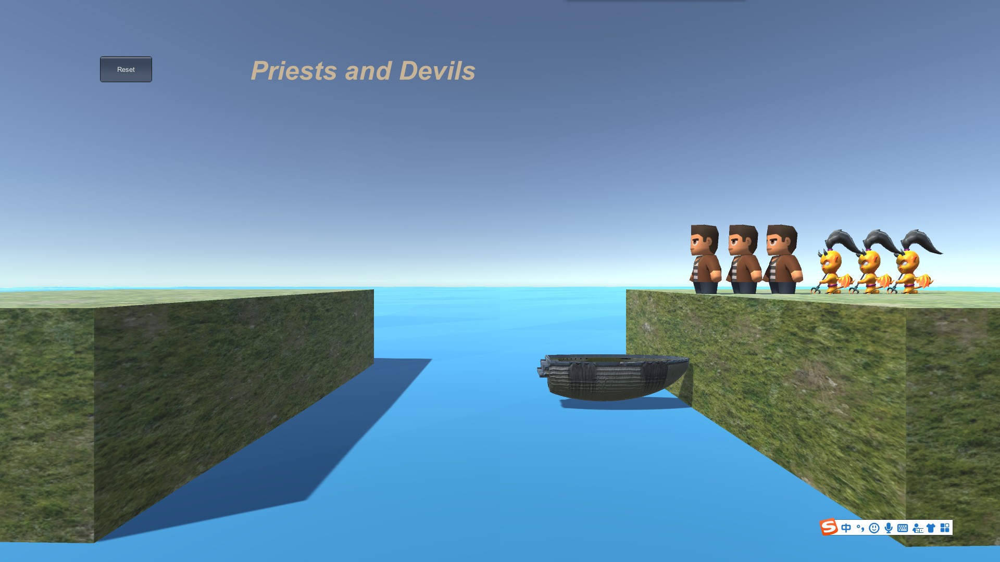
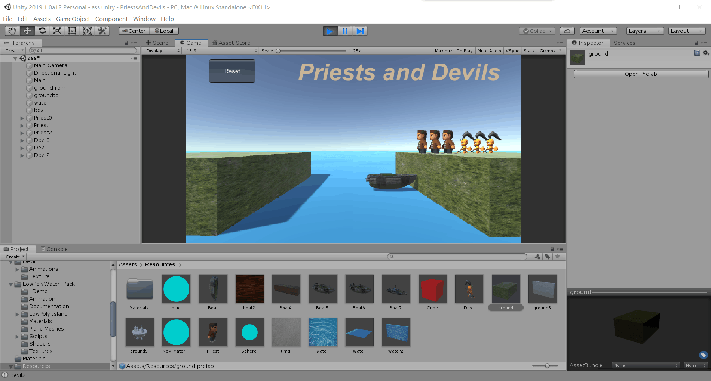

# Priests and Devils

完整工程文件在github(<https://github.com/JennySRH/3DGame/tree/master/PriestsAndDevils>)。

游戏视频<https://www.bilibili.com/video/av68091576>

## 游戏中的事物

牧师，恶魔，船，河流，两岸

其中牧师是红色方块，恶魔是蓝色球体，船是棕色长方体。



但是这样的游戏界面实在太过于单调，所以经过我的修改，最终游戏界面如下图所示，其中，水面还利用正弦函数增加了波浪效果。



## 规则表

| 当前状态                           | 玩家操作                           | 结果                   |
| ---------------------------------- | ---------------------------------- | ---------------------- |
| 牧师或恶魔在岸边，船上有空位       | 玩家点击靠近船一侧岸上的恶魔或牧师 | 恶魔或牧师上船         |
| 牧师或恶魔在船上                   | 玩家点击船上的恶魔或牧师           | 恶魔或牧师上靠近船的岸 |
| 其中一侧的恶魔的数量大于牧师的数量 | ——                                 | 显示玩家输             |
| 恶魔和牧师全部到河边另一侧         | ——                                 | 显示玩家赢             |


## 游戏对象

灰色长方体——堤岸

棕色长方体——船

蓝色长方体——河

红色正方体——牧师

蓝色球体——恶魔


## 设计过程

游戏框架如下图所示


`Director`职责如下所示：

- 获取当前游戏的场景
- 控制场景运行、切换、入栈与出栈
- 暂停、恢复、退出
- 管理游戏全局状态
- 设定游戏的配置
- 设定游戏全局视图

```c#
public class Director : System.Object {
    private static Director _instance;             //导演类的实例
    public SceneController scene { get; set; }
    public static Director GetInstance()
    {
        if (_instance == null)
        {
            _instance = new Director();
        }
        return _instance;
    }
}

```

`Director`类是单实例的，具有全局属性，可以在任何地方访问它，它继承至 `C#` 根对象，所以不会受 Unity 引擎管理，也不要加载。它通过一个抽象的场景接口访问不同场的场记（控制器）。例如：它不知道每个场景需要加载哪些资源，它可以与实现 `SceneController` 的不同场记对话。

### controller

虽然在本次项目中，我们只创建了一个场景控制器`FirstController`，但是为了设计的完整性，我们还是需要定义一个场记控制器接口`SceneController`。

```c#
public interface SceneController
{
    void LoadResources();           //加载场景
    void print();                   // 打印 测试用
    int getPosition(string name);   // 获取位置
    void moveto(string name);		// 移动
    void Reset();	                // reset
}
```

我们实现`SceneController`接口，创建了`FirstController`，并挂载到一个空物体上，便于初始化加载。该场景控制器首先需要加载游戏中的资源，并进行各种初始化。在此之前，我们先要将游戏对象做成预制，便于我们的直接使用。



然后加载到场景中。

```c#
   public void LoadResources()
    {
        Debug.Log("load resource");

        state = -1;

        // 创建新的GUI
        mygui = new UserGUI();

        // 加载数量
        fromDevilNum = fromPriestNum = 3;
        toDevilNum = toPriestNum = 0;


        // 加载地面
        GroundFrom = Object.Instantiate(Resources.Load("ground", typeof(GameObject)), new Vector3(0, -5, 15), Quaternion.identity, null) as GameObject;
        GroundFrom.name = "groundfrom";
        GroundTo = Object.Instantiate(Resources.Load("ground", typeof(GameObject)), new Vector3(0, -5, -15), Quaternion.identity, null) as GameObject;
        GroundTo.name = "groundto";

        // 加载水
        Water = Object.Instantiate(Resources.Load("Water", typeof(GameObject)), new Vector3(0, -9, 0), Quaternion.identity, null) as GameObject;
        Water.name = "water";

        // 加载船
        boat = new Boat();

        // 加载牧师对象
        for (int i = 0;i < 3;i ++)
        {
            Role temp = new Role("Cube");
            temp.setName("Priest"+ i);
            Priests[i] = temp;
            float p_z = (float)(8 + i * 1.5);
            Priests[i].setOriginalPos(new Vector3(0, 0, p_z));
            Priests[i].setDestPos(new Vector3(0, 0, -p_z));
        }

        // 加载恶魔对象
        for (int i = 0; i < 3; i++)
        {
            Role temp = new Role("Sphere");
            temp.setName("Devil" + i);
            Devils[i] = temp;
            float p_z = (float)(13 + i * 1.5);
            Devils[i].setOriginalPos(new Vector3(0, 0, p_z));
            Devils[i].setDestPos(new Vector3(0, 0, -p_z));

        }

    }
```

作为场记类，`FirstController`还需要响应各种事件。在本游戏中需要响应的事件为：鼠标点击、游戏重置、检测游戏输赢。游戏点击的事件触发是通过`Move`类来通知的。`Move`类实际上是一个检测类，挂载到所有可以移动的游戏对象上，用来检测是否有鼠标点击事件。如果鼠标点击了某个可移动的游戏对象，该类将告知场记，然后场记再交给相应的处理程序。

```c#
public class Move : MonoBehaviour {

    void OnMouseDown()
    {
        //Debug.Log("onmousedown");
        Director.GetInstance().scene.moveto(transform.name);
    }
	// Use this for initialization
	void Start () {}
	// Update is called once per frame
	void Update () {}
}
```

### model

而本游戏中的事物如船、牧师、恶魔等，便是MVC模式中的model了。我们创建一个`Role`类和`Boat`类来作为相应的模型类，用来记录每个事物的状态等。

```c#
public class Role {
    public GameObject character;
    public Move moveto;
    public int position;    // 0:from 1:to 2:boat
    public int boatPos;     // 0 1
    public Vector3 origin;
    public Vector3 dest;
    public Role(string name)
    {
        position = 0;
        character = Object.Instantiate(Resources.Load(name, typeof(GameObject)), Vector3.zero, Quaternion.identity, null) as GameObject;
        moveto = character.AddComponent(typeof(Move)) as Move;
    }

    public void setName(string name)
    {
        character.name = name;
    }

    public void getBoat(int i)
    {
        position = 2;
        if (i == 1)
        {
            boatPos = 0;
            character.transform.position = new Vector3(0, -3, 4);
        }
        else if(i == 2)
        {
            boatPos = 1;
            character.transform.position = new Vector3(0, -3, 6);
        }
        else if(i == 3)
        {
            boatPos = 1;
            character.transform.position = new Vector3(0, -3, -4);
        }
        else
        {
            boatPos = 0;
            character.transform.position = new Vector3(0, -3, -6);
        }
    }

    public void setOriginalPos(Vector3 a)
    {
        character.transform.position = a;
        origin = a;
    }

    public void setDestPos(Vector3 a)
    {
        dest = a;
    }

    public void MoveToOrigin()
    {
        position = 0;
        character.transform.position = origin;
    }

    public void MoveToDest()
    {
        position = 1;
        character.transform.position = dest;
    }

}


public class Boat{
    public int[] BoatState;  // 记录船上的载荷位置
    public int num;         // 记录载荷
    public int position;        // 记录船的位置:0在from的位置，1在to的位置
    public GameObject thisboat;
    public Move moveto;
    public Boat()
    {
        num = 0;
        position = 0;
        BoatState = new int[2];
        BoatState[0] = BoatState[1] = 0;
        thisboat = Object.Instantiate(Resources.Load("Boat", typeof(GameObject)), new Vector3(0, -4, 5), Quaternion.identity, null) as GameObject;
        thisboat.name = "boat";
        moveto = thisboat.AddComponent(typeof(Move)) as Move;

    }
}
```

### view

场景类的接口是`IUserAction`。

```c#
public interface IUserAction 
{
    void display();
    void setLose();
    void setWin();
}
```

`UserGUI`实现了该场景类的接口，用来作为`GUI`显示button、label等部件。同时通过跟`controller`的交互传递信息，改变状态。

```c#
public class UserGUI : MonoBehaviour, IUserAction {

    private int state;

    public UserGUI()
    {
        state = -1;
    }

    public void setWin()
    {
        state = 1;
    }

    public void setLose()
    {
        state = 0;
    }

    public void display()
    {
        OnGUI();
    }

    void OnGUI()
    {
        GUIStyle style = new GUIStyle
        {
            border = new RectOffset(10, 10, 10, 10),
            fontSize = 50,
            fontStyle = FontStyle.BoldAndItalic,
        };
        // normal:Rendering settings for when the component is displayed normally.
        style.normal.textColor = new Color(200 / 255f, 180 / 255f, 150 / 255f);    // 需要除以255，因为范围是0-1
        GUI.Label(new Rect(240, 10, 200, 80), "Priests and Devils", style);
        if (GUI.Button(new Rect(50, 10, 100, 50), "Reset"))
        {
            Director.GetInstance().scene.Reset();
        }
        if (state == 0)
        {
            style.normal.textColor = new Color(255 / 255f, 0 / 255f, 0 / 255f);
            GUI.Label(new Rect(330, 350, 200, 80), "You Lose!", style);
        }
        if (state == 1)
        {
            style.normal.textColor = new Color(255 / 255f, 0 / 255f, 0 / 255f);
            GUI.Label(new Rect(340, 350, 200, 80), "You Win!", style);
        }
    }
}
```

基本的框架搭建完毕后，再在此基础上进行游戏逻辑的设计（游戏的动作、输赢逻辑等）就简单多了，在此不做赘述，详细见github(<https://github.com/JennySRH/3DGame/tree/master/PriestsAndDevils>)。

实现效果如下所示：

