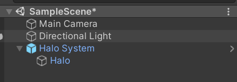
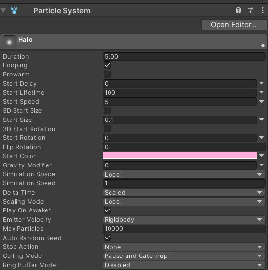
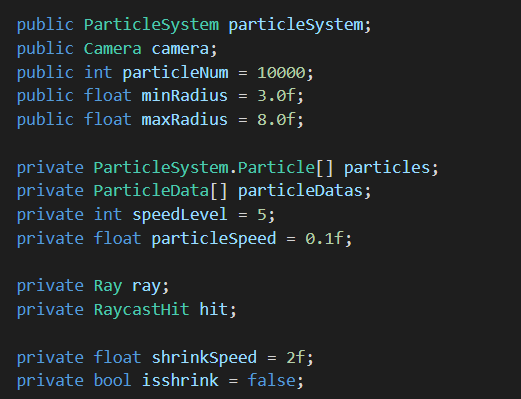
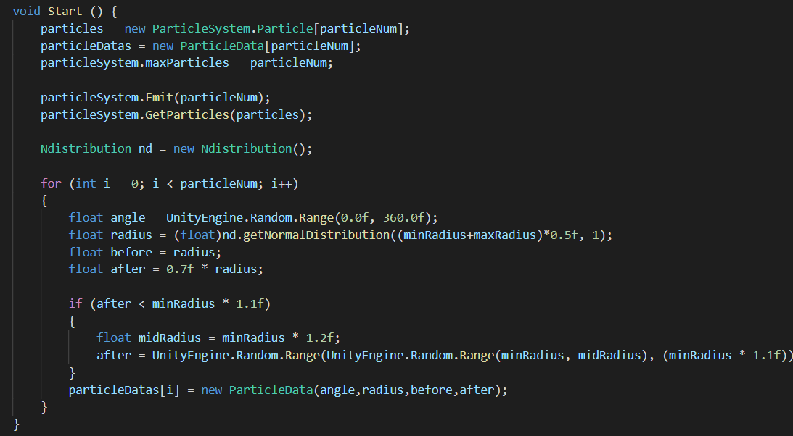
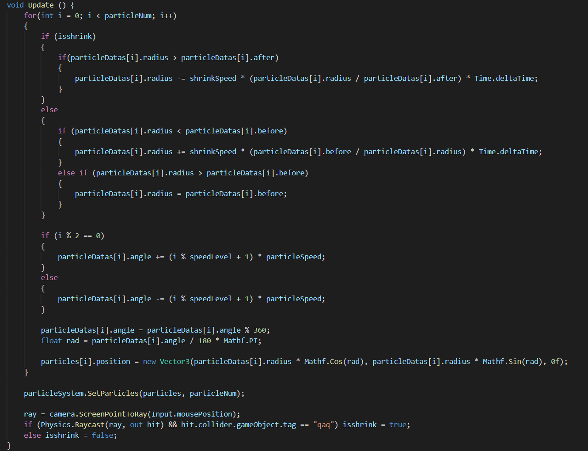
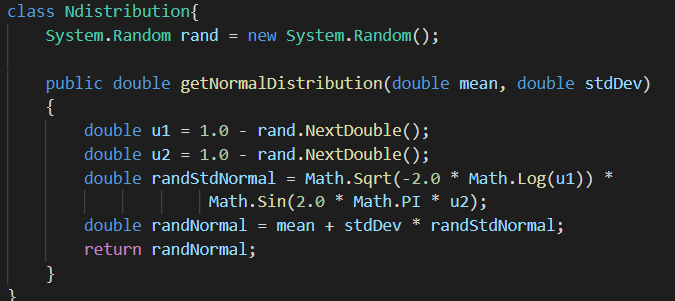
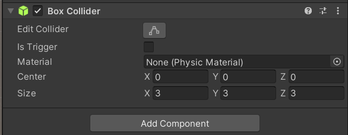
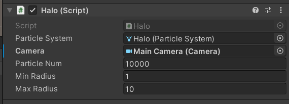
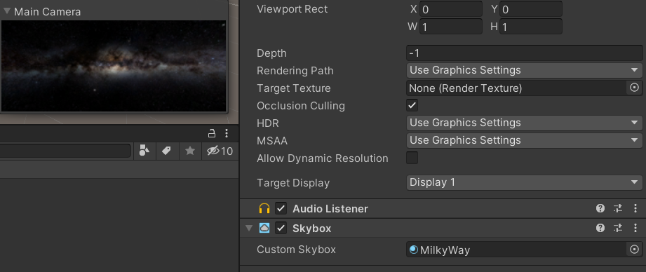
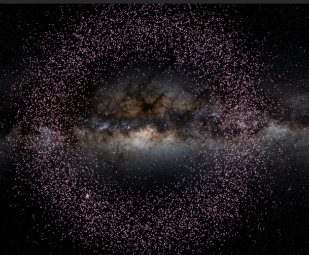

## 作业与练习

本次作业基本要求是**三选一**

1、简单粒子制作

- 按参考资源要求，制作一个粒子系统，[参考资源](http://www.cnblogs.com/CaomaoUnity3d/p/5983730.html)
- 使用 3.3 节介绍，用代码控制使之在不同场景下效果不一样

2、完善官方的“汽车尾气”模拟

- 使用官方资源资源 Vehicle 的 car， 使用 Smoke 粒子系统模拟启动发动、运行、故障等场景效果

3、参考 http://i-remember.fr/en 这类网站，使用粒子流编程控制制作一些效果， 如“粒子光环”

- 可参考以前作业

 

## 作业

参考了以往学长学姐的博客，这次我选择粒子流编程，编程粒子光环的效果。

首先我们创建空物件，然后改名为Halo System

然后在其中创建粒子系统。

然后调整粒子系统的一些参数如下所示

然后我们开始编写其粒子运动的代码。

首先我们先定义其基础属性，比如粒子数量、粒子速度、最大半径最小半径等。

然后我们定义其中每一个粒子的运动方向和下一个时刻的状态。

之后我们定义其缩放的过程

然后我们在halo system中添加box collider

之后将脚本拖到Halo粒子系统上，选择对应的Camera以及粒子系统。

最后我们采用了MilkyWay中的天空盒来作为我们光环的背景。在Camera中设置即可。

最终效果：

